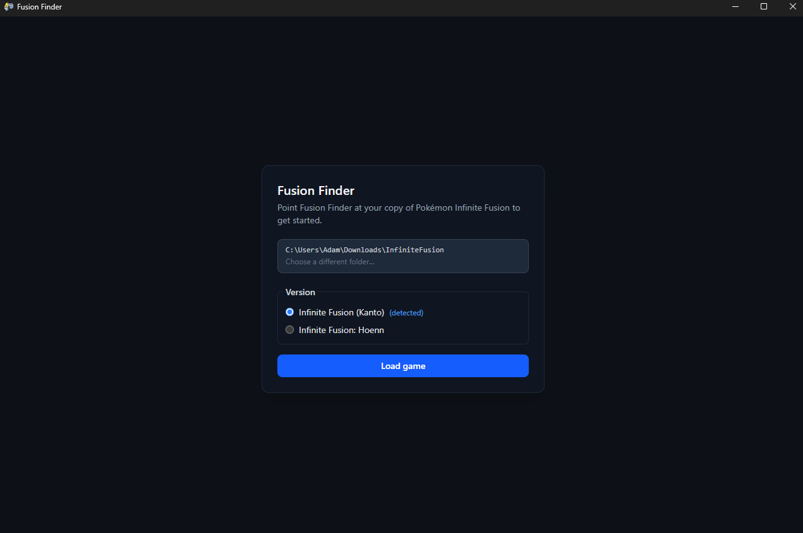
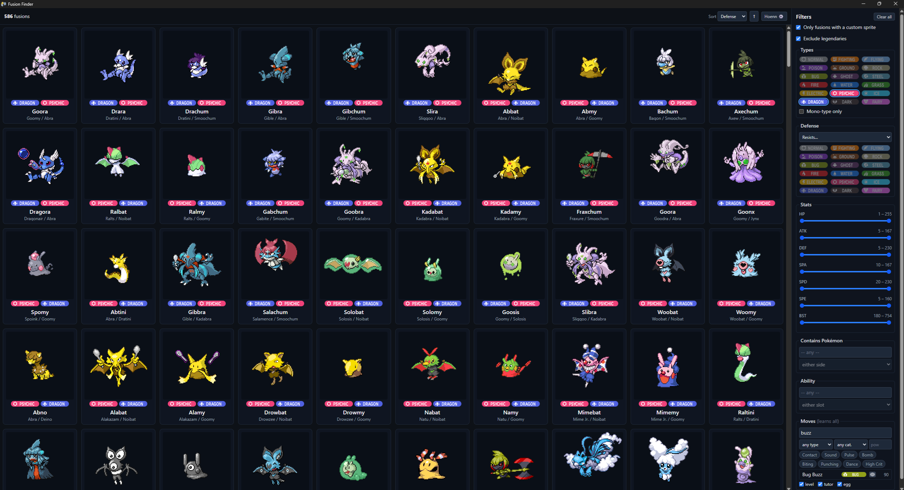
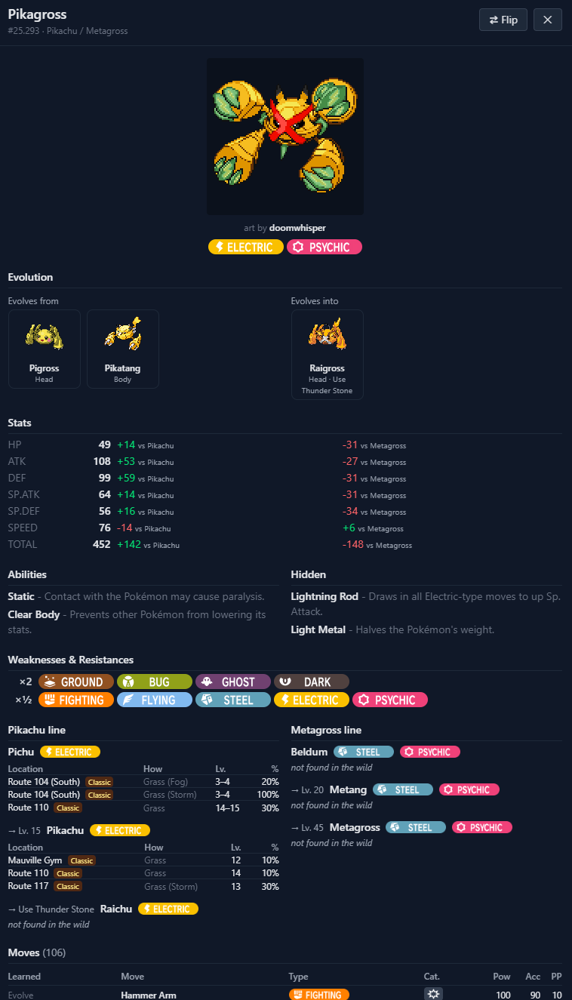

# Fusion Finder

A desktop pokedex for the Pokémon fan game [Infinite Fusion](https://discord.com/invite/infinitefusion), built with Tauri, SvelteKit and caffeine.

# How to use?
On first launch you'll get a page just asking you to select where your game is. Select the directory you have the game installed to and you should see the following.

Then just hit "Load game" and you're off to the races.

---

Above is the main view, to the right is the filter pane where you can select conditions for which fusions you wish to appear. To the top right is the clear all button and to the left of that is the sort buttons (and the option to switch game).

Clicking a card will bring up the "inspect" view (below)

---

In the inspect view you'll find the meat and potatoes of the fusion. How do its stats compare to the base form? What moves does it get access to? Where can you find the components to make it?

## Development
[Tauri docs](https://v2.tauri.app/start/), get 'er installed then you can just do `cargo tauri dev` or your equivalent in `npm`/`bun`/`deno`/`pnpm`.
Tests require a copy of infinite fusion + infinite fusion hoenn, I set it in my `.cargo/config.toml`:
```toml
[env]
INFINITE_FUSION_DIR = "C:\\Users\\YOURNAMEHERE\\WHEREVERYOUHAVEITINSTALLED\\InfiniteFusion"
INFINITE_FUSION_HOENN_DIR = "C:\\Users\\YOURNAMEHERE\\WHEREVERYOUHAVEITINSTALLED\\InfiniteFusion2"
```